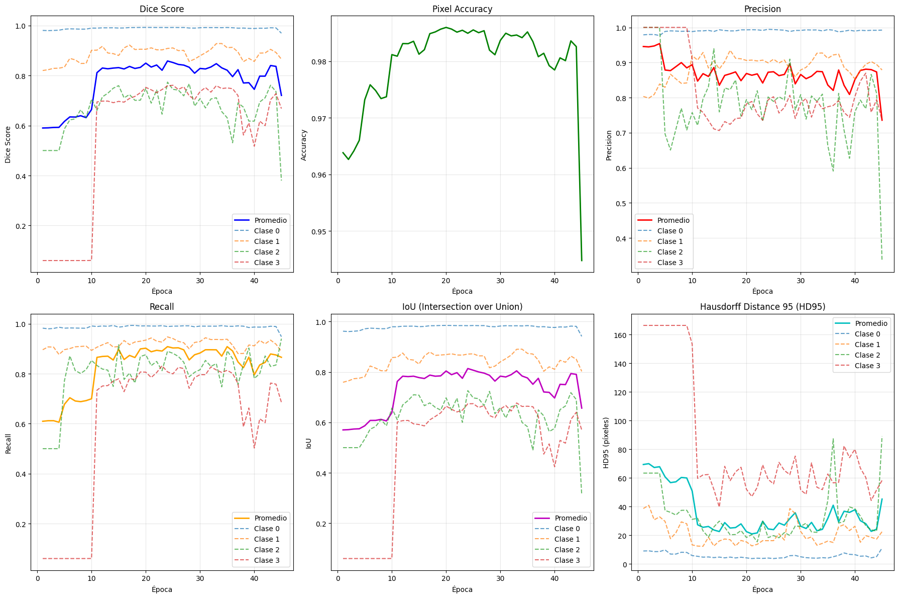

This project focuses on multiclass segmentation of chest CT images, based on the Chest CT Segmentation dataset available on Kaggle  https://www.kaggle.com/datasets/polomarco/chest-ct-segmentation.

To tackle this task, we implemented and compared three widely used architectures in medical image segmentation:
	•	U-Net
	•	U-Net++
	•	Swin-Unet

Among these, Swin-Unet achieved the best performance, leveraging Transformer-based attention mechanisms to enhance segmentation accuracy.

